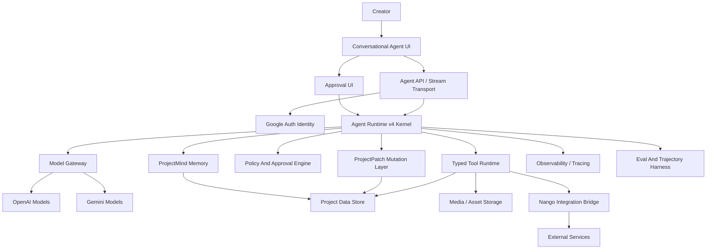
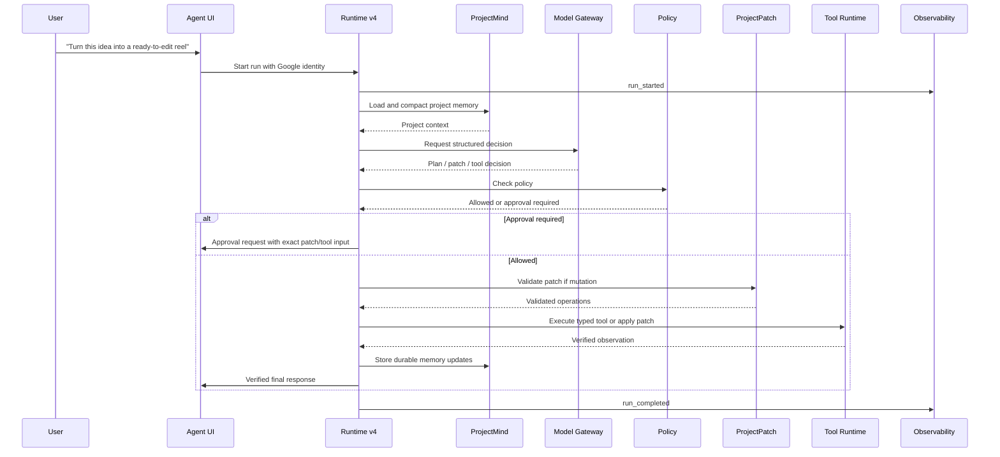

# Target Architecture - SceneBook Agent v4

## 1. Architecture Goal

SceneBook Agent v4 is a production agent system for short-form video work. It separates conversation, runtime planning, memory, typed tools, mutations, model providers, integrations, approvals, observability, and evals.

The architecture must support a Claude Code-like creative production loop: the user gives intent, the agent inspects the project, plans concrete steps, applies typed changes, verifies results, and narrates only what actually happened.

## 2. High-Level System



## 3. Major Components

### 3.1 Conversational Agent UI

The UI is the primary control surface. It renders:

- user messages,
- agent responses,
- concise plans,
- tool progress,
- ProjectPatch previews,
- approval prompts,
- memory highlights,
- verified change summaries,
- recovery options after failures.

The UI should feel conversational-first, not form-first. It should expose the agent's work without making normal users read raw traces.

### 3.2 Transport Layer

The transport layer receives messages, authenticates the user, validates request shape, creates or resumes a run, opens a stream, and delegates to Agent Runtime v4.

It must not own model prompts, workflow branches, tool execution, patch application, or integration logic.

### 3.3 Google Auth Identity

Google auth provides the user identity for:

- project access checks,
- connected-account ownership,
- approval attribution,
- run trace attribution,
- ProjectPatch authorship,
- memory provenance,
- integration connection lookup.

The runtime should receive a normalized identity object rather than raw auth provider details.

### 3.4 Agent Runtime v4 Kernel

The kernel is the public runtime entrypoint. API routes call `AgentKernel`, and the kernel selects the orchestration path:

- `AGENT_ORCHESTRATOR=custom` uses the custom runtime loop.
- `AGENT_ORCHESTRATOR=langgraph` delegates orchestration to `SceneBookGraph`.

The kernel is responsible for run lifecycle, stream compatibility, assistant-message persistence, summary persistence, and graph trace metadata. The selected orchestrator owns the internal loop.

The LangGraph orchestrator coordinates:

1. Create or resume run.
2. Load project state and ProjectMind.
3. Compact context.
4. Plan and decide through deterministic logic or model gateway.
5. Validate structured decision.
6. Evaluate policy.
7. Produce ProjectPatch, tool call, question, or final response.
8. Execute through typed runtime if allowed.
9. Verify result.
10. Write memory and trace events.
11. Continue or respond.

The kernel is independent from HTTP and should be testable with fixture inputs.

LangGraph owns graph mechanics only: node execution, state transitions, loop routing, and stop-condition checkpoints. SceneBook-owned modules still provide ProjectMind, model gateway calls, decision schemas, policy decisions, typed tool execution, event vocabulary, and traces.

### 3.5 ProjectMind Memory

ProjectMind is the durable memory and production-state layer for each SceneBook project.

Memory categories:

- creative brief,
- active goal,
- production stage,
- script versions,
- shot and asset intent,
- visual style decisions,
- creator preferences,
- platform assumptions,
- open questions,
- resolved answers,
- rejected directions,
- integration summaries,
- analytics learnings,
- run summaries.

ProjectMind produces two views:

- full state for traces and deterministic code,
- compact model context for the model gateway.

### 3.6 Model Gateway

The model gateway isolates all provider-specific behavior.

Responsibilities:

- route by model role,
- support Gemini as a first-class provider,
- support structured outputs,
- normalize errors,
- capture token and latency metadata,
- enforce model-role budget policy,
- provide fallback behavior,
- keep provider SDK calls out of runtime modules.

Example roles:

- `planner`,
- `decision`,
- `script_writer`,
- `creative_critic`,
- `asset_prompt_writer`,
- `multimodal_reader`,
- `summary_writer`,
- `eval_judge`.

### 3.7 Policy And Approval Engine

The policy engine decides whether an action is allowed, blocked, or approval-gated.

Inputs:

- user identity,
- project permission,
- action type,
- ProjectPatch risk,
- tool side effect,
- integration side effect,
- overwrite risk,
- destructive risk,
- cost risk,
- publishing risk,
- workspace policy.

Outputs:

- allowed,
- blocked,
- requires approval,
- risk level,
- reason,
- approval copy,
- trace metadata.

### 3.8 ProjectPatch Mutation Layer

ProjectPatch is the canonical way to represent workspace mutations before they are applied.

The patch layer provides:

- structured operations,
- validation,
- diff summary,
- policy metadata,
- approval preview,
- application,
- verification,
- audit trail,
- rollback metadata where practical.

This prevents model text from directly becoming database writes.

### 3.9 Typed Tool Runtime

The typed tool runtime provides a central registry and executor.

Tool contract:

```ts
type AgentTool<TInput, TOutput> = {
  name: string;
  displayName: string;
  description: string;
  inputSchema: Schema<TInput>;
  outputSchema: Schema<TOutput>;
  sideEffect: ToolSideEffect;
  approvalPolicy: ApprovalPolicy;
  requiredIntegration?: IntegrationProvider;
  availability: ToolAvailability;
  handler: ToolHandler<TInput, TOutput>;
  verify?: ToolVerifier<TOutput>;
};
```

The executor owns validation, policy checks, status events, handler execution, output validation, verification, persistence, and observations.

### 3.10 Nango Integration Bridge

Nango handles external OAuth integrations and token lifecycle. Agent tools use Nango-backed adapters to call external services.

The runtime should know:

- whether a connection exists,
- which provider and account are connected,
- which scopes are available,
- whether reconnect is required,
- whether an external action requires approval.

The runtime should not expose raw tokens to the model, UI, or traces.

### 3.11 Observability And Tracing

Tracing must connect every event in a run:

- request,
- identity,
- ProjectMind load,
- prompt context summary,
- model gateway call,
- decision,
- policy result,
- patch validation,
- approval request,
- tool call,
- integration call,
- verification,
- memory write,
- final response.

This is required for debugging, eval replay, cost monitoring, and production trust.

### 3.12 Eval And Trajectory Harness

The eval harness validates behavior before release and after changes.

It must test:

- decisions,
- routing,
- plans,
- tool sequences,
- ProjectPatch operations,
- approval boundaries,
- failure handling,
- final-response truthfulness.

## 4. Runtime Flow



## 5. Conceptual Module Layout

This phase does not implement code, but the target code ownership should separate responsibilities like this:

```txt
lib/agent/runtime-v4/
  kernel/
  transport/
  identity/
  memory/projectmind/
  model-gateway/
  decision/
  policy/
  project-patch/
  tools/
  integrations/nango/
  workflows/
  observability/
  evals/
```

## 6. ProjectMind Data Shape

Conceptual state:

```ts
type ProjectMind = {
  projectId: string;
  stage: ProductionStage;
  creativeBrief: CreativeBriefMemory;
  activeGoal?: ActiveGoalMemory;
  openQuestions: QuestionMemory[];
  decisions: DecisionMemory[];
  rejectedDirections: RejectedDirectionMemory[];
  scripts: ScriptMemory[];
  assets: AssetIntentMemory[];
  shootPlan?: ShootPlanMemory;
  editorHandoff?: EditorHandoffMemory;
  publishPackage?: PublishPackageMemory;
  integrations: IntegrationMemory[];
  analyticsLearnings: AnalyticsLearningMemory[];
  runSummaries: RunSummaryMemory[];
};
```

ProjectMind must distinguish user-approved facts from model inferences.

## 7. ProjectPatch Data Shape

Conceptual patch:

```ts
type ProjectPatch = {
  id: string;
  projectId: string;
  runId: string;
  authorUserId: string;
  summary: string;
  risk: "low" | "medium" | "high" | "blocked";
  approval: ApprovalRequirement;
  operations: ProjectPatchOperation[];
  validation: PatchValidationResult;
  application?: PatchApplicationResult;
  verification?: PatchVerificationResult;
};
```

Patch operations should be domain-specific. They should not expose arbitrary database mutation primitives to the model.

## 8. Approval Policy Matrix

| Action | Default Policy |
|---|---|
| Draft response with no mutation | Auto |
| Create draft brief field | Auto |
| Resolve user-answered question | Auto |
| Create script draft/version | Auto |
| Replace active approved script | Ask if overwrite |
| Delete script, asset, or memory | Always ask |
| Generate paid media asset | Ask if costly |
| Create editor handoff artifact | Auto |
| Mutate editor timeline | Always ask |
| Prepare publish package | Auto |
| Schedule or publish externally | Always ask |
| Send external message or notification | Always ask |
| Use disconnected integration | Block and prompt connect |

## 9. UI Architecture Principles

The UI should make the agent feel operational:

- show the active project and stage,
- show the current goal when present,
- keep the composer always available,
- render plans as editable production steps,
- render tools as meaningful progress rows,
- render patch previews as before/after summaries,
- render approvals with exact action details,
- render final responses as verified outcomes and next action.

The UI should avoid:

- raw JSON by default,
- generic chatbot disclaimers,
- hidden background mutations,
- optimistic success claims,
- overwhelming multi-question interrogations.

## 10. Integration Boundaries

Nango-backed integration adapters should live outside the core runtime. The runtime asks for capabilities and invokes typed tools. Adapters handle provider-specific API details.

The model should never receive raw OAuth tokens, refresh tokens, provider secrets, or service credentials.

## 11. Deployment Shape

Agent v4 should launch behind a feature flag.

Recommended rollout:

1. Internal offline evals.
2. Local feature flag with mocked integrations.
3. Staging with Google auth and model gateway.
4. Staging with Nango connection state.
5. Private beta for docs/script/asset-plan workflows.
6. External-side-effect tools after approval policies and traces are proven.

## 12. Architecture Constraints

- No runtime code is implemented in phase 00.
- The route must remain thin.
- The model gateway owns all provider calls.
- ProjectPatch owns workspace mutation representation.
- Typed tools own operational side effects.
- Approval policy is deterministic.
- Traces are required for production debugging.
- Evals are release gates, not optional QA artifacts.
